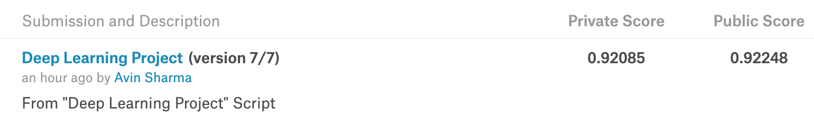
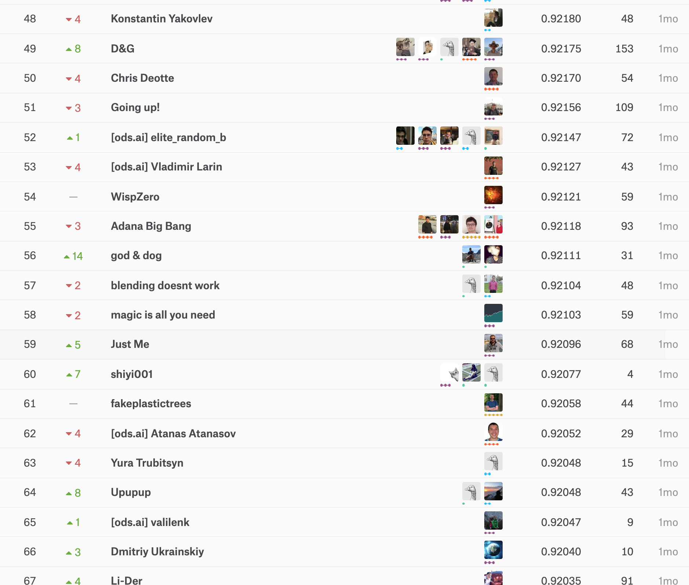

CS583A: Course Project
Avin sharma, Himanshu Kumar
May 19, 2019

# Summary
We pariticipated in an active with late submission competition of Santander Customer Transaction Prediction where the goal was to identify which customers will make a specific transaction in the future, irrespective of the amount of money transacted. The data provided for this competition has the same structure as the real data they have available to solve this problem.The data given was composed of 200.000 rows and 200 anonymized features, there is no intuition or explanation given for the data provided.
The final model we choose is **Light GBM**. Light GBM is a gradient boosting framework that uses tree based learning algorithm. We implement the model using lightGBM package and run the code on a MacBook Pro with one Intel i7 CPU and 32 GB memory. Performance is evaluated on the classification accuracy, kaggle score and ranking.
In the public and private leaderboard, our score is 0.9227123; We are in top 10%. Though the result on the public leaderboard is not available due to late submission glitch. But we can prove it through a screenshot attached in the jupyter notebook.

# Problem Description
### Problem
In this challenge, we should help this bank identify which customers will make a specific transaction in the future, irrespective of the amount of money transacted. The data provided for this competition has the same structure as the real data we have available to solve this problem.
### Data 
The data provided for this competition has the same structure as the real data they have available to solve this problem.The data given was composed of 200.000 rows and 200 anonymized features, there is no intuition or explanation given for the data provided. 
### Challenges
The data is highly unbalanced,There are 10.049% target values with 1 and rest are 0.

# Solution
### Model
The model we finally choose is the Light GBM which is a gradient boosting framework that uses tree based learning algorithm.Light GBM grows tree vertically while other algorithm grows trees horizontally meaning that Light GBM grows tree leaf-wise while other algorithm grows level-wise. It will choose the leaf with max delta loss to grow. When growing the same leaf, Leaf-wise algorithm can reduce more loss than a level-wise algorithm. Light GBM is prefixed as ‘Light’ because of its high speed. Light GBM can handle the large size of data and takes lower memory to run.It is advised to use LGBM on large datasets with 10,000+ rows.Since,  Light GBM is sensitive to overfitting and can easily overfit small data.

### Implementation
We implemented the LGBMClassifier and it took 30 mins to train the model.
Settings. The loss function is binary cross-entropy. Challenge was to get the hyperparameters such as learning rate,n_estimators,num_leaves,reg_alpha,reg_lambda. We didn't use the grid-search but by studying these parameters and changing it a little bit from their default values, we were able to get the good results.

# Compared Methods
**Simple Neural Network1** : We used the 2 Dense layer with activation as sigmoid and loss as binary crossentropy.The training and validation accuracies are respective 90.68% and 90.55%.
Though the model is very modest but there is a twist in data preparation, which helped us in getting good accuracy with such a simple model. We standardized each variable with mean 0 and variance 1.

**Simple Neural Network2** : Since the data is highly unbalanced, we thought of applying K-stratified cross validation, with above Neural network.The training and validation accuracies are respective 91.50% and 91.40%. We can see there is an improvement from the previous model. So our hypothesis of using K -stratified was correct.

# Outcome
In the public and private leaderboard, our score is 0.9227123; We are in top 10%. Though the result on the public leaderboard is not available due to late submission glitch. But we can prove it through a screenshot attached in the jupyter notebook. 

